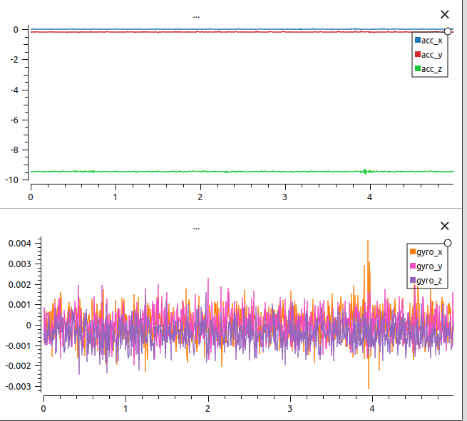

# VN100 example to read data

## 3rd parties libs used:
 - [Hexdump](https://github.com/wahern/hexdump)
 - [Boost-Serial-Port](https://github.com/Tai-Min/Boost-Serial-Port)
 

## How to use

1. Load config [VN100-Config.xml](media/VN100-Config.xml) to you IMU using [VectorNav Center](https://www.vectornav.com/resources/software)
2. Compile
3. Start loging example using example command
```
./print_vn100 /dev/ttyUSB0 data.csv 10
```
4. Imu should open IMU on port `/dev/ttyUSB0` , log to `data.csv` for 10 second
5. You can visualize [outputdata](media/imu_data_pointZ_Up.csv) with e.g. PlotJuggler:\
 
